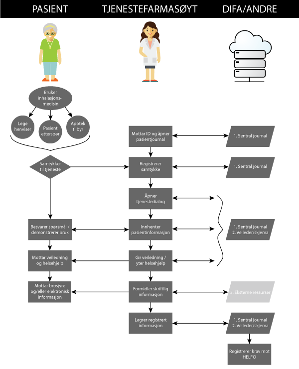

    
# Innledning

Løsningsbeskrivelsen av DIFA er delt inn i fire områder:

1. Omfanget av løsningen. Dette gir en overordnet beskrivelse av hva som inngår i løsningen. Som et vedlegg til kapittelet har leverandøren inkludert et utkast til en komplett product backlog med estimater.
2. Prosjektgjennomføring. Dette gir en beskrivelse av metodene som benyttes, med leveranser og aktiviteter; organisering med teammedlemmer og tidsperspektiv. Beskivelsen dekker spesielt sikkerhet og testing.
3. Systemdesign beskriver hvordan løsningen fungerer og kommuniserer med omverden. Beskrivelsen omfatter mange, men ikke alle de funksjonelle aspektene. Beskrivelsen er strukturert etter 4C modellen: Context, Container, Component og Classes.
4. Administrative detaljer. Vurderinger som ikke er omfattet av andre deler av løsningsforslaget beskrives her.

## Executive Summary

Leverandørens forståelse av oppgaven, er at DIFA skal være et system som håndterer resepter, refusjoner, farmasøytiske tjenester og pasientjournal for disse tjenestene, og er tenkt å være et system som systemene til kjedene skal integreres mot. Kjedene vil selv utvikle sine logistikksystemer og kassasystemer (Point-Of-Sale eller POS), og vil gjøre kall mot DIFAs tjenester for å håndtere det faglige arbeidet i et apotek. Dokumentet beskriver også en opsjon på et brukergrensesnitt for de apoteker som ønsker å håndtere resepter gjennom den bakenforliggende løsningen DIFA.

Gjennom dette dokumentet beskriver leverandøren hvordan vi forstår prosessene som ligger i et slikt system, samt fremheve hvilke tjenester vi forstår at dette systemet skal levere. Dokumentet beskriver først funksjonaliteten i systemet i form av prosessbeskrivelse, deretter hvordan denne disse prosessene vil bli implementert i faser og med en prosjektgjennomføringsmodell. Til slutt beskriver dokumentet illustrerende deler av løsningen for å vise hvordan helheten henger sammen og hvordan noen kritiske enkeltkomponenter fungerer i detalj.

Leverandøren vil spesielt presisere at vi legger opp til å levere veldig tidlig en teknisk spesifikasjon og kjørende test-versjon av API som gjør det mulig for kjedene å starte sine etableringsprosjekter i 2017.

DIFA vil levere følgende tjenester:

| Område                | Tjeneste                                  |
|-----------------------|-------------------------------------------|
| Reseptur              | Finn person                               |
|                       | List resepter for person eller referanse  |
|                       | Ekspeder resepter                         |
|                       | Velg legemiddel/vare på resept            |
|                       | Beregne refusjon                          |
|                       | Oppdater reseptetikett                    |
|                       | Teknisk kontroll                          |
|                       | Farmasøytkontroll                         |
|                       | Klargjør utlevering                       |
|                       | Utlevering fullført                       |
| Refusjonskrav         | Vis refusjonskravstatus                   |
| Tjeneste i apotek     | Start tjeneste                            |
|                       | Oppdater tjenestejournal                  |
|                       | Fullfør tjeneste                          |
| Pasientjournal        | Vis reseptutleveringer for person         |
|                       | Vis farmasøytiske tjenester for person    |
|                       | Vis innsynslogg for person                |
|                       | Vis logg over intervensjoner, varsler, interaksjoner, kansellerte ekspedisjoner |
| Rapportering          | Hent rapport til offentlig instans        |
|                       | Hent datagrunnlag til bransjestatistikk   |

Merk at alle oppslag på pasientinformasjon skal logges med årsak til oppslaget og eventuell legitimasjon for den som krevde oppslaget. Merk at all rapporteringsinformasjon vil ha fjernet koblinger til identifiserbare personer.

## Resultatmål

Avtalen dekker leveranse av første versjon av DIFA som skal inneholde nødvendig funksjonalitet for å understøtte reseptbehandling i apoteker. Systemet DIFA skal i versjon 1.0 levere et API til apotekkjedene for håndtering av resepter, refusjon og utvalgte farmasøytiske tjenester. Leveransen innebærer tilstrekkelig ytelseskrav levert til et definert nettverksmessig point-of-delivery. Leveransen inneholder nødvendige test- og driftsmekanismer for å sikre at apotekkjedene kan ta i bruk tjenesten samt integrasjon med tjenester på Norsk helsenett som skal til for å realisere tjenesten.

## Endringer i denne versjonen av løsningsbeskrivelsen

Ved presentasjon av forrige versjon ble leverandøren bedt om å detaljere konsekvensene med GUI ytterligere. Leverandøren har fjernet anbefalingen om å ikke levere GUI opsjonen, men i stedet lagt på en merknad om faktorer som kjeder som ønsker dette må være bevisst på.

Migreringsplan er endret basert på tilbakemeldinger fra forrige presentasjon. Så lenge kjeder forventer å ta i bruk reseptur API tidlig anser leverandøren ikke lenger FarmaPro bro-løsning som viktig. Den oppdaterte migreringsplanen fokuserer i stedet på å frikoble tekniske komplekse leveranser fra leveranser med stor forretningsmessig konsekvens.

# Funksjonelt omfang (jfr avtalens punkt 1.1)

Leverandøren har valgt å gruppere funksjonaliteten i grovkornede funksjonelle områder som tilsvarer det vi ser som sammenhengende funksjonalitet. Hvert område er tekstlig beskrevet med en funksjonell flyt. Hvert sted i denne funksjonelle flyten vil typisk gi opphav til en eller flere product backlog items. Dette kapittelet utgjør en uttømmende beskrivelse av prosjektets omfang, men detaljer under hvert punkt er utelatt i beskrivelsen. Teksten skal *definere* omfanget, men beskrivelsen av detaljene forutsetter at prosjektmedlemmene i felleskap med funksjonelle eksperter diskuterer og fastsetter forløpende i prosjektgjennomføringen.

Detaljer som ikke er beskrevet rundt hvordan forretningsregler er implementert og meldinger er utfylt vil som en hovedregel bruke FarmaPro som kilde til hvordan de fungerer. e-Resept og reseptur har mange spesialregler og det er utenfor omfanget av løsningsbeskrivelsen å detaljere alle, men leverandøren vurderer FarmaPro som et godt svar på spørsmål om spesifikke forretningsregler.

Omfang som ikke inngår i et funksjonelt område er beskrevet som Krav til tjenesten DIFA. Dette inngår også i product backlog.

Et utkast til en fullstendig product backlog ligger vedlagt.

## Begrepsmodell

Følgende figur illustrerer de viktigste begrepene i DIFA og hvordan de henger sammen. I grensesnittet mellom kjedesystemene og bransjesystemet ser leverandøren for seg at disse begrepene har engelske navn med utgangspunkt i HL7-standarder (se systemdesign for detaljer).

Et viktig poeng med DIFA er at man dokumenterer aksjonene som ble tatt basert på farmasøytiske varsler. Modellen må også synliggjøre de legemidlene som resepten kan utleveres for (byttegruppe mm).

Det mest uventede begrepet i modellen har vi i mangel på et bedre navn kalt "ReseptBunke". Alle resepter forskrevet av samme lege på samme dato inngår i samme "bunke". Reseptformidleren behandler dem under ett for en egenandelsperiode og DIFA må være bevisst på at en resept under ekspedering i en bunke kan skape krøll med egenandelen andre resepter i bunken. (Blåreseptforskriften § 8)

## Funksjonell flyt reseptur

Denne flyten illustrerer hvordan aktørene interagerer med systemet under reseptbehandling. Stegene som blir utført av apotektekniker kan også utføres av farmasøyt, for å forenkle beskrivelsen skriver vi kun "apotekansatt" for disse stegene.

1. Pasientens fastlege registrerer en resept i Reseptformidleren vha sin EPJ
    * Variant: Lege utskriver resept til bruk i egen praksis (Forskrift om legemidler fra apotek, § 5-2)
    * Variant: Legen utskriver i eget navn for å verne pasient.
    * Variant: Legen skriver ut resept på papir. Se separat flyt.
2. Pasienten identifiserer seg på apotek og ber apotekansatt få resepten ekspedert
    * Apotekansatt finner kunde i folkeregisteret
    * Variant: Pasient bruker resept-id i stedet for legitimasjon for å identifisere seg
    * Variant: Person med registrert fullmakt henter resept på pasientens vegne
    * Variant: Resept til person uten fødselsnummer/D-nummer
    * Variant: Resepten bestilles som forsendelse over telefon eller elektronisk
    * Variant: Resepten hentes av institusjon eller hjemmehjelptjeneste (ekspederes som ordre)
    * Variant: Dersom pasienten er en multidosekunde skal apotekansatt varsles om dette. (Multidoseekspedering er ikke omfattet av denne beskrivelsen)
3. Apotekansatt henter reseptliste fra Reseptformidleren for pasienten via sitt POS og DIFA
4. Apotekansatt laster ned resepter som skal ekspederes fra Reseptformidleren
    * Variant: Systemet hindrer en resept som er under behandling i et annet apotek fra å ekspederes
    * Variant: Systemet gir apotekansatt varsel *før* nedlastning dersom pasientens resepthistorikk indikerer at ekspederingen kan gi interaksjoner, dobbelt forskrivning, doseendring eller nytt legemiddel
    * Variant: Systemet formidler varsler som er registrert på legemiddelet fra legemiddelverket eller FarmaLogg
5. Apotekansatt vurderer bytte til et rimeligere legemiddel i samme byttegruppe
    * Variant: Lege, apotek eller pasient kan reservere seg mot generisk bytte
    * Variant: Farmasøyt bestemmer intervensjon i form av endret dosering, vare, refusjonshjemmel eller personopplysninger
7. Apotekansatt skriver ut reseptetikett og foretar teknisk kontroll ved å lese av strekkode på pakning og etikett
    * Variant: Apotekansatt kan skrive ut avstemplingslapp eller navnelapp for senere avhenting
    * Variant: Systemet sjekker avlest QR-kode på pakning mot forfalskningsregisteret
8. Farmasøyt registrerer aksjoner for advarsler farmasøytkontroll på apotekansatts arbeidsstasjon eller på separat arbeidsstasjon eller mobil enhet
    * Systemet vil avvise utleveringen dersom nødvendige aksjoner ikke er dokumentert
9. Pasient signerer og betaler for utleveringen og mottar legemidlene
9. Systemet registrerer utleveringen i Reseptformidlere og sender eventuelt refusjonskrav til HELFO. Reseptformidleren markerer resepten som ekspedert dersom det ikke gjenstår iterasjoner.

### Spesialtilfeller

* Dersom DIFA eller Reseptformidleren ikke kan nåes fra apotekets POS kan apotekansatt etterregistrere resept som nødresept
* Utlevering på papirresept: Legemidlene på resepten som blir utlevert blir registrert av apotekansatt manuelt. Resepten kan om nødvendig registreres etter utlevering. Pasientens signatur kan registreres fra scannet dokument i stedet for signaturpad.
* Nødekspedering: Farmasøyt oppføres som rekvirent?
* Pasient returnerer vare for kreditering: M10 og M18 med negative beløp og antall skal generes. Egenandel på M10 for perioden må reduseres.
* Apotekansatt benytter DIFA GUI for resepthåndtering (fullstendig scenario)
* Veterinærresept. Sterk identifisert person kun ved A/B resept. Papirresept (system innenfor langsiktig målbilde)
* Legen sender ekspederingsanmodning til et spesifikt apotek
* Anbrudd - apotekansatt registrerer anbrudd og DIFA vedlikeholder et anbruddsregister
* Pasient ekspederer resept via nettapotek (fullstendig scenario, men ikke i denne leveransen)
* Multidose-apotek ekspederer legemidler i bruk for pasient (fullstendig scenario, men ikke i denne leveransen)

## Funksjonell flyt refusjon

1. Apotekansatt registrerer reseptlevering for en resept med refusjonshjemmel
2. Systemet beregner korrekt refusjon
    a. Systemet slår opp egenandelfritak for pasient fra NAV
    b. Pasienter uten fødselsnummer eller D-nummer, inkludert EØS borgere
    c. Pasienten kan ikke være død
    d. Legemidler med forhåndsgodkjent refusjon (§ 2)
    e. Individuell søknad (§ 3 - M3, M14, M15, M20)
    f. § 4 (legemidler mot smittsomme sykdommer utlevert til personer som ikke er medlem i folketrygden)
    g. Medisinsk forbruksmatriell (§ 5) ihht pris- og produktliste fra Helsedirektoratet
    h. Prevensjonsmidler til jenter under 20 år
    i. Byttereservasjon til vare som er over trinnpris eller AUP
    j. Refusjon for preparater uten refusjonspris eller maks AUP
    k. Varsle ved AIP høyere enn akseptabelt gevinstdeling
    l. Refusjoner for tjenester ytet i apotek (inhalasjonsveiledning, LAR, i fremtiden medisinstart)
    m. Tak på egenandel per resept per tremånedersperiode
    n. Arbeidspris (Rundskriv 7/2008 fra Legemiddelverket (pkt. 6)) - gjelder tilbereding av antibiotikamiksturer
    o. Andre refusjonsinstanser enn NAV (jernbaneverket)
    p. H-resept - betales av helseforetakene ("men kan brukes utenfor sykehus") - separat M18
    q. Verneplikt - egenandelsfritak
    r. Yrkesskade ?? § 5-25, brystproteser
3. Pasienten kan nå motta legemidlene og forlate apoteket
4. HELFO sender oppgjørsresultat når kravet er validert (typisk noen få minutter)
    * Unntak: Dersom HELFO avviser kravet kan apotekmedarbeider korrigere kravet og sende på nytt
    * Unntak: Dersom HELFO avviser kravet skal tjenesteleverandøren håndtere dette som en B-feil
5. Kjedens regnskapssystem henter status fra systemet på refusjonskrav og oppretter fordringer [eller er dette bedre beskrevet som faktura?]
6. HELFO sender utbetalingsmelding når betalingen er utført
7. Kjedens regnskapssystem henter status fra systemet og registrerer betaling av fordringen

## Funksjonell flyt farmasøytiske tjenester

1. Ved utlevering av legemiddel varsler systemet apotekansatt om at det kan være aktuelt å yte relevant tjeneste basert på resept eller tjenestehistorikk (NB: Er dette tillatt ifg personvernforordningen?)
   * Inhalasjonsveiledning
   * Foreslått inkludert i 1.0: Medisinstart
   * Foreslått inkludert i 1.0: LAR
   * Mulighet: Legemiddelgjennomgang
   * Mulighet: Legemiddelveiledning
   * Mulighet: Vaksinering
   * Mulighet: Føflekkscanning
2. Pasienten ønsker å motta tjenesten
3. Apotekansatt får opp veiledning for utførelse av tjenesten
    * Veiledningen kan være i form av et spørreskjema som fylles ut i samråd med pasient og med linker til mer omfattende dokumentasjon
4. Apotekansatt registrerer detaljer om tjenesten som ble ytet
5. Pasient signerer for tjenesten
6. Apotekansatt avslutter tjenesten i systemet
7. Tjenesten blir dokumentert i apotekets journal
    * Pasient kan på forespørsel få innsyn i egne journalopplysninger
    * I en senere versjon kan journalen leveres til helsenorge.no
8. Systemet registrerer refusjonskrav mot HELFO
    * Refusjonskravet kan være avhengig av detaljer om tjenesten. For eksempel, for LAR: Overvåket inntak av flytende metadon har en sats på 36,75 kr, mens Buprenorfin tabletter har 98 kr. For Medisinstart: Ulik refusjonspris per oppfølgingspunkt

## Pasientjournal

Både resepthistorikk og journal for farmasøytiske tjenester er underlagt pasientjournallovens § 3.Saklig virkeområde: "Loven gjelder all behandling av helseopplysninger som er nødvendig for å yte, administrere eller kvalitetsikre helsehjelp til enkeltpersoner." [Merk imidlertid Pasientjournalforskriften § 2.(Unntak for apotek)]

Disse journalene inneholder også personlig identifiserbar informasjon og vil dermed være underlagt Personvernforordningen (som erstatter ditto lov, forskrift og direktiv).

Disse to regelsettene er i stor grad overlappende og innebærer en del funksjonalitet og aktiviteter som vil inngå i product backlog:

* All tilgang til journalene skal loggføres (pasientjournalloven § 16. Forbud mot urettmessig tilegnelse av helseopplysninger)
* Når en bruker slår opp pasientopplysninger skal DIFA kreve at brukeren registrerer årsaken til oppslaget samt legitimasjon for den som forespurte oppslaget om relevant
    * Systemet vil holde tilbake informasjon som den som gjør oppslaget ikke skal ha (for eksempel ved vergeinnsynsperre)
* Bruker med relevant autorisasjon skal ettergå tilgangslogg
    * Variant: Bruker kan søke opp kritiske hendelser som kansellerte ekspederinger, nødekspedering og intervensjon
* Pasienter må kunne få utlevert medisiner uten å bli registrert (pasientjournalloven § 17. Rett til å motsette seg behandling av helseopplysninger). MÅ DISKUTERES HVORDAN DET SKAL LØSES FUNKSJONELT.
* Bruker med relevant autorisasjon kan ta ut informasjon om en pasient på pasientens forespørsel (pasientjournalloven § 18. Informasjon og innsyn)
* Bruker med relevant autorisasjon kan rette og sperre informasjon om en pasient på pasientens forespørsel (personopplysningsloven § 27. Retting av mangelfulle personopplysninger)
* Pasientjournalen vil oppdage og forhindre at brukere forsøker å hente ut store mengder med data på kort tid ("resource governor")
* Som en del av målbilde skal DIFA avlevere informasjon om en pasient til helsenorge.no slik at pasienten kan være selvbetjent på innsyn (pasientjournalloven § 18. Informasjon og innsyn)

## Rapporter

Alle rapporteringsgrensesnitt må renses for personlig identifiserbar informasjon. Personopplysningsloven § 11 krever at personopplysninger ikke lagres lengre enn nødvendig. Siden rapporter vil eksporteres fra systemet må disse anonymiseres for å oppfylle lovkravet.

Rapportene vil være basert på reseptutleveringer, men vil ikke inneholde kobling til person. I stedet vil fødselsnummer være erstattet med en sikker generert nøkkel. Nøkkelen vil ikke være et sekvensnummer ettersom dette vil fortelle noe om når den var generert. Der det ikke er påkrevd vil informasjon om hvilket apotek som foretok ekspederingen fjernes. Der det ikke er mulig vil apotek fortrinnsvis erstattes med fylke eller kommune/bydel.

TODO: Dette blir helt annerledes

1. DIFA overfører periodisk grunnlag der personopplysninger er fjernet til rapporteringsdatabase
2. System som bruker rapporterte data henter ned rapporter etter eget behov
    * Systemet autentiseres med en oauth2 bearer token fra kjedes Identity Provider (Active Directory eller tilsvarende)
    * Systemet autoriseres basert på systemets rolle (tildelt fra kjede)
    * Systemet kan spesifisere at kun data etter et gitt tidspunkt skal returneres
3. DIFA sender rapporter på email periodisk til mottakere som har behov for dette

Rapportene vil være på maskinlesbare formater.

Rapportmottakere:   

* Folkehelseinstituttet
* Mattilsynet
* Helsetilsynet

Følgende rapporter viser apotekenes fagarbeid

* Interaksjonsstatistikk
* Ekspedisjonsstatistikk
* Gjennomføringsevne farmasøytiske tjenester (se også under farmasøytiske tjenester)

Kundebetaling resept: Må ikke behovet for dette dokumenteres?

Følgende rapporter inngår i journalhåndtering og dekkes av den delen av løsningsbeskrivelse:

* Innsynsrapport
* Kansellerte reseptformidleroppslag
* Intervensjoner

### Bransjestatistikk

DIFA inneholder kun legemiddeldelen av bransjestatistikken. Leverandøren ser for seg to måter dette kan løses:

a. Et uavhengig system henter datagrunnlag fra DIFA og sammenstiller med grunnlaget fra kjedene.
b. DIFA henter datagrunnlag fra kjedene og sammenstiller dette til en felles rapport

## Brukergrensesnitt

### Foreslått inkludert brukergrensesnitt: Farmasøytkontroll, farmasøytiske tjenester, journal

* Farmasøyt kan hente opp en liste over reseptkurver for valgt apotek som er klare for farmasøytkontroll
* Farmasøyt kan utforske varsler om legemidlene i en reseptkurv og notere aksjoner på disse
* Farmasøyt kan godkjenne reseptkurv for utlevering
* Opsjon: Farmasøyt mottar et varsel når en resept er klar for farmasøytkontroll

* Farmasøyt kan gjennomføre farmasøytiske tjenester i et effektivt brukergrensesnitt

* Administrator kan gjennomføre alle journalrelaterte operasjoner i et egnet brukergrensesnitt

### Brukersnitt for test og demo: Reseptekspedering test-GUI

Merk at farmasøytkontroll foreslås levert som en del av kjerneløsningen

1. Apotekansatt søker opp person
2. Apotekansatt viser reseptliste for person
3. Apotekansatt velger resepter for ekspedering
4. Apotekansatt gjennomfører generisk bytte
5. Apotekansatt viser varsler, legemiddelinformasjon og ekspederingstøtte
6. Apotekansatt gjennomfører teknisk kontroll
7. Apotekansatt registrerer signatur og utleverer resept

### Opsjon: Reseptekspedering GUI

* Apotekansatt får se priser og beholdning for varer under gjennomføring av generisk bytte
* DIFA skal støtte nødvendig interaksjon med kjeders POS
* DIFA skal ha en effektiv og innbydende visuell karakter
* DIFA brukergrensesnittet skal brukertestes

## Krav til tjenesten DIFA

### Sikkerhet

DIFA løsningen oppbevarer store mengder pasientopplysninger og det er kritisk at prosjektet har fokus på både sikkerhet og personvern. Et slikt fokus skjer ikke av seg selv og prosjektet vil derfor planlegge konkrete tiltak og sikkerhetsmessige gjennomganger.

Sikkerhetskravene i prosjektet tar utgangspunkt i Normen faktaark 38 og OWASP ASVS versjon 3.

* Tilgangsstyring (helsepersonelloven § 48): Apotekkjedene vil være ansvarlig for sikker og korrekt *identifisering* av bruker opp og angivelse av HPR nr. Bransjeløsning vil være ansvarlig for rettighetskontroll, spesielt opp mot Helsepersonalregisteret.
* Sikker kommunikasjon med eHelse: Systemet skal signere meldinger til HELFO og RF i henhold til Rammeverk for elektronisk meldingsutveksling i helsevesenet
    * Systemet vil behandle private nøkler til virksomhetssertifikater uten at forretningstjenester har direkte tilgang til nøklene (OWASP ASV 7.11)
    * Systemet vil tillate trygg oppdatering av virksomhetssertifikater
* Personopplysninger vil så langt det er mulig lagres i kryptert form. (OWASP ASVS 7.29). Sikker oppbevaring av data (apotekloven, personopplysningsloven): Oppbevaring i EU (personopplysningsloven § 29). Sikkerhetstiltak ihht personopplysningsloven § 13.
* Personopplysninger vil automatisk fjernes fra systemet etter 12 måneder. Vinduet for historiske data vil være mulig å endre.

Prosjektet skal gjennomføre sikkerhetskontroller ved hver leveranse:

* Prosjektet vil gjøre sikkerhetsrevisjon ved hver viktige leveranse. Revisjonen vil spesielt vektlegge:
    * Systemet er satt opp og konfigurert i henhold til korrekte sonemodeller
    * Normen faktaark 6b sjekkliste B
    * OWASP ASVS V3 - Session Management
    * OWASP ASVS V4 - Access controll
    * OWASP ASVS V5 - Malicious input handling
    * OWASP ASVS V7 - Cryptography at rest
    * OWASP ASVS V8 - Error handling and logging
    * OWASP ASVS V9 - Data protection
    * OWASP ASVS V15 - Business logic
    * OWASP ASVS V18 - Web services
* Prosjektet skal sette opp verktøy for statisk analyse av koden med spesielt fokus på sikkerhetsmessige svakheter
* Privacy Impact Assessment i henhold til standardisert veileder
* Teknisk orientert trusselmodellering der hele teamet deltar

DIFA vil stille krav til kjedenes Identity Provider:

* Passordkrav ihht normen (faktaark 6b)
* Nivå 3 sikkerhet der det er nødvendig for å sikre pasientvern (eller nivå 4)

### Dokumentasjon og testbarhet

* Systemets API vil dokumenteres i Swagger UI som også kan brukes for å teste alle tjenestekall mot et testsystem
* Systemet vil leveres med et brukergrensesnitt som kan brukes til å demonstrere og verifisere oppførsel uten å være koblet mot et kjedesystem
* Testsystemet vil være satt opp med Identity Provider (for eksempel Active Directory) for en fiktiv apotekkjede
* Testsystemet vil være satt opp med en statisk kopi av FarmaLogg og HPR
* Testsystemet vil leveres med en simulator for kommunikasjon med RF, HELFO og NAV
* Prosjektet vil sette opp verktøy for automatisert lasttesting av alle APIer
* Prosjektet vil understøtte avbruddstest i henhold til driftsavtalen

### Drift, vedlikehold og oppdateringer:

* DIFA skal kunne motta datadump-filer fra eksisterende FarmaPro instanser. Systemet skal effektivt håndtere fulleksport minst en gang i døgnet, slik at FarmaPro kan laste opp filer i en lang overgangsperiode. Eksportfilene skal være lagret kryptert der den private nøkkelen kun er kjent av DIFA-systemet.
* Administrator kan registrere endringer satser for refusjonsordninger som gjelder fra angitte datoer (alternativt: Informasjonen hentes fra et annet system)
* Systemet må kunne oppdatere lister over legemidler og produkter som er godkjent for refusjon
* SLA overvåking: Systemadministrator og systemeier vil kunne se på statistikk over alle tjenestekall per tjeneste og aggregert på tjenesteområder. Statistikken skal inneholde bruksfrekvens og responstidstatistikk og understøtte krav om ytelse, skalerbarhet og oppetid. Statistikk skal kunne vises med oppløsning på månedsnivå og dagsnivå.
    * Dersom Leverandøren også leverer drift faller dette inn under driftsavtalen. Dersom drift skal leveres av en tredjepart vil driftsleverandør være ansvarlig for å produsere rapporter etter utviklingsleverandørens spesifikasjon
* Ytelse og skalerbarhet: Applikasjonen vil håndtere 500 http requester per sekund på topp. 95% av requestene der bruker må vente på svar skal respondere innen 0,5 sekunder.
    * Kunden spesifisere 200.000 resepter om dagen. Av mangel på mer detaljert statistikk antar leverandøren konservativt at halvparten av dette er i løpet av en time. Det gir opphav til en toppbelastning på 30 resepter per sekund. Arkitekturen legger opp til cirka 12 http requester per sekund med opptil 10 sql queries per request.
* Tjenesten skal ha 99,7% oppetid målt på månedsbasis med 30 minutter RPO. Opptid skal måles fra point-of-delivery for DIFA.
    * Nedetid på eHelse og andre nødvendige integrasjoner skal trekkes fra nedetidsberegningen
    * Dersom teknisk drift leveres av tredjepart skal nedetid på nettverk og servere trekkes fra nedetidsberegningen. Dersom leverandørens opsjon om drift innløses inngår nedetid på nettverk og servere som leverandøren er ansvarlig for i nedetidsberegningen
    * Leverandøren anbefaler å utløse driftsopsjonen for å sikre en fullstendig tjenesteleveranse
* Enkeltnoder i applikasjonen skal kunne fjernes og legges til uten å berøre brukerne. Applikasjonsservere må være uavhengig av sesjonstilstand.
* Nye versjoner av systemet vil kunne produksjonsettes uten å berøre brukere
    * Fatale feil ved nye versjoner skal kunne oppdages raskt og rulles tilbake med påvirkning på et minimum antall apotek
* Feilhåndtering: Systemadministrator skal varsles dersom en kritisk hendelse inntreffer i logger
    * Systemadministrator skal kunne se årsaken til vanlige problemer et sentral loggverktøy (Splunk)
* Ved nye leveranser vil det dokumenteres hvordan bakoverkompabilitet og fremoverkompabilitet er støttet. Viktige vurderinger i den forbindelse:
    * Klienten angir API versjon som en del av URL. DIFA vil støtte eldre versjoner så langt kjedene er avhengig av dem og de lar seg støtte gitt forholdene til reseptformidleren.
    * Nye leveranser kan legge til output-felter og ikke-påkrevde input-felter på et eksisterende API. Teknisk sagt skal nye leveranser av eksisterende API støtte Liskovs Subtitution Principle (LSP)
    * Endringer i API som endrer navn på felter, fjerner felter eller legger til nye påkrevde input-felter skal leveres i form av en ny API versjon.
    * Dersom kommende endringer i Reseptformidleren krever ikke-bakoverkompatible endringer i DIFA vil DIFA gjøre det mulig å utføre endringer i kjedesystemene _før_ endringene trer i kraft i Reseptformidlere for å gi kjedene fleksibilitet

## Utfordrende områder

### Sertifikathåndtering

Se kapittelet om Sikkerhetsarkitektur. Denne løsningen må godkjennes av direktoratet for e-Helse. Det vil være vanskelig å se for seg at DIFA kan levere et forenklende API dersom e-Helse ikke godkjenner løsningen.

### Beregning av interaksjoner basert på meldinger fra Reseptformidleren

For å forbedre pasientsikkerheten samtidig som man ivaretar personvernet ville det være en fordel om Reseptformidleren kunne endres til å inkludere legemiddelkode i Reseptlista (M9.2)

Av hensyn til personvern og master data er det en fordel om DIFA benytter reseptformidleren fremfor egen resepthistorikk. Av hensyn til pasientsikkerheten er det viktig å kunne se interaksjon mellom tidligere resepter og resepter som er til ekspedering.

Reseptliste-meldingen fra Reseptformidleren (M9.2) inneholder historiske reseptutleveringer. Men meldingen inneholder ikke forskrivningsinformasjonen, kun NavnFormStyrke, som er "Sammenstilling av varenavn, legemiddelform for preparatet og styrke.»

Dersom Reseptformidleren endres til å la ReseptInfo i reseptliste inkludere Forskrivning (fra ReseptDokLegemiddel) som var angitt i Resepten (M1) (eventuelt ReseptDokHandelsvare for relevante resepter) samt inkludere historiske resepter som kan være helsemessig relevante, så vil DIFA kunne gjøre interaksjonskontroll og varsling med Reseptlista som input (i tillegg til FarmaLogg).

Alternativt må DIFA laste ned reseptene (M9.3, M9.4) eller bruke resepthistorikk for å gjøre denne beregningen.

## Vedlegg: Utkast til product backlog

# Prosjektgjennomføring

Kjernen av prosjektgjennomføringen er en kontinuerlig, løpende prosess som omsetter behovene som er formulert i product backlog til kjørende programkode i en fungerende løsning som er tilgjengelig for apotekkjedene. Prosessen skiller ikke mellom nyutvikling eller feilretting og videreutvikling.

Et av hovedelementene i prosessen er å produksjonssette hyppig og jevnlig. Dette sikrer tidlig verdiskapning, reduserer risiko og gir mulighet for læring og tilpasning underveis. I normalrytmen vil produksjonssetting gjøres hver uke. Produksjonssetting vil også gjøres uten opplevd nedetid på løsningen ved hjelp av en såkalt rolling wave-strategi der én og én server prosess tas ned, oppgraderes og restartes.

Dette er derimot ikke det samme som at løsningen må gjøres tilgjengelig for alle brukere fra første produksjonssetting. Dette er et valg som gjøres ut fra forretningsmessige hensyn. Tilgang til de ulike delene av løsningen kan styres uavhengig av når de blir produksjonssatt gjennom konfigurasjonsflagg og tilgangsstyring på bruker og kjedenivå.

## Organisering og tidsplan (ref bilag 4)

### Resultatmål: Konvertering fra FarmaPro til DIFA

I konkurransegrunnlaget har kunden beskrevet en milepælsplan som starter med dagens reseptur-funksjonalitet som versjon 1.0 og inkluderer ytterligere tjenester i versjon 2.0. Leverandøren frykter at denne planen vil eksponere prosjektet for stor risiko ved første viktige produksjonssetting. Derfor foreslår leverandøren i stedet at prosjektet går opp leveranseapparatet med en versjon som har lavere forretningsmessig risiko. Leverandøren foreslår i stedet å legge inn medisinstart, legemiddelassistert rehabilitering og inhalasjonsveiledning som en prøveversjon som beviser levedyktigheten til prosjektmetoden og plattformen. Med denne planen vil leveransene med stor teknisk kompleksitet ha lav forretningsmessig konsekvens og retrettmuligheter, mens første produksjonsetting med høy forretningsmessige vil ha få nye tekniske problemstillinger.

En total prosjektplan kan være som på følgende figur. Numre angir cirka uketall. Aktivitetene markert med lysegrønt inngår ikke i omfanget i SSA-T men er foreslått levert som en del av SSA-V i form av prosjektavrop for videreutvikling. Det er allikevel inkludert for å gi et bedre totalbilde.   

Hvert versjon inkluderer spesifikasjon, utvikling og testaktiviteter knyttet til versjonen. Prosjektet vil foreta en teknisk produksjonsetting med cirka ukentlig frekvens, men funksjonalitet vil godkjennes når et funksjonelt område er komplett.

DIFA versjon 1.0 vil leveres gjennom SSA-T som et utviklingsløp og en endelig akseptansetest og godkjenning. Ut over dette vil prosjektet leveres gjennom en smidig utviklingsmetodikk med funksjonelle akseptansetester underveis. Disse skal ikke anses for å være delleveranser under SSA-T. Leverandøren vil i sin testplan sette krav til Kundens medvirkning underveis i prosjektet.     

#### Steg 1: Testbart API

Det testbare API'et vil la apotekene teste sine POS systemer mot et API i et simulert, ikke-personsensitivt miljø der Reseptformidleren og HELFO er erstattet med simulatorer. API'et vil også leveres med et enkelt GUI som vil inkludere integrasjon med kjedenes Identify Provider (for eksempel Active Directory).

Ved å levere et versjon som ikke behandler personsensitiv informasjon i produksjonsmiljøet først vil prosjektet sette opp et produksjonsklart miljø uten risiko på brudd på regelverk.

Omfang av versjonen:

| Oppgave                                                                       |
|-------------------------------------------------------------------------------|
| Brukergrensesnitt for å legge opp en testresept og gjennomføre ekspedering    |
| Innlastning av grunnregistre (helsepersonell og legemidler)                   |
| Kommunikasjon med DIFA API                                                    |
| Utrulling av server                                                           |
| Autentisering av DIFA GUI                                                     |
| Nedlastning av resept (korrekt RF simulator)                                  |
| Signering av meldinger mot RF                                                 |
| Papirresept                                                                   |
| Beregning av enkle refusjonskrav                                              |
| Farmasøytiske varsler                                                         |
| Egenandelsgrenser, trinnpris, makspris                                        |

#### Steg 2: Farmasøytiske tjenester

Med farmasøytiske tjenester kan apotekene registrere medisinstart, LAR og inhalasjonsveiledning, kreve refusjon fra HELFO, følge opp refusjonskrav og oppfylle minimumskrav i pasientjournalloven og personvernforordningen. Løsningen vil inkludere et brukergrensesnitt for å registrere farmasøytiske tjenester som autentiseres med kjedes brukersystemer.

Versjonen vil inkludere viktige sikkerhetsmekanismer som vil understøtte resepturflyten: Sertifikathåndtering i kommunikasjonen mot HELFO (M18) og nødvendige sikkerhetsmekanismer for å understøtte dette (HSM).

Denne versjonen er ment til å tas i bruk av apotekene. Dette er en versjon med lav risiko: Dersom noe ikke skal være av tilstrekkelig kvalitet kan apotekene benytte eksisterende prosedyrer for å registrere og kreve refusjon for relevante farmasøytiske tjenester. Det vil antageligvis være hensiktsmessig å ta i bruk kun én farmasøytisk tjeneste den første måneden etter versjon og gradvis rulle inn andre tjenester.

I denne versjonen vil løsningen måtte godkjennes av Direktoratet for e-Helse. Kunden er ansvarlig for å etablere korrekt dialog med direktoratet, mens leverandøren er ansvarlig for den operative oppfølgingen av akseptansetesten.

#### Steg 3: Resepthistorikk

Versjonen vil inkludere å sette opp datamigrering fra FarmaPro til sentralt resepthistorikk, inkludert et GUI for å gjøre oppslag i resepthistorikk. Versjonen vil inkludere en minimumsløsning av funksjonalitet for å oppfylle pasientjournalloven, spesielt tilgangslogging og pasientinnsyn. I denne versjonen vil spesielt pasientinnsyn være støtte med det minimum som loven krever.

Datamigrering vil implementeres ved at FarmaPro versjon 5.20 nattlig laster opp en kryptert eksport av registre. DIFA importerer differansen ved å sammenligne eksporten fra hvert apotek med informasjonen DIFA allerede har fra apoteket. DIFA vil lese inn eksportfilene umiddelbart og slette disse etter fullført innlesning.

Versjonen vil også inkludere de mest kritiske rapporteringsfunksjonene, spesielt bransjestatistikken.

#### Steg 4: Reseptur API

Denne versjonen vil utvide API'et for reseptur med integrasjon mot HELFO og Reseptformidleren og inkludere et enkelt GUI for demo, test og akseptanse av løsningen.

I denne versjonen vil løsningen måtte godkjennes av Direktoratet for e-Helse. Kunden er ansvarlig for å etablere korrekt dialog med direktoratet, mens leverandøren er ansvarlig for den operative oppfølgingen av akseptansetesten.

Denne versjonen fullfører versjon 1.0 av omfanget i løsningsbeskrivelsen, samt farmasøytiske tjenester.

#### Steg 5: Reseptur fullstendig (avtalefestet i SSA-V-avtalen)

Denne versjonen vil inkludere rapporter som ikke allerede er levert, samt forbedringer for å etterleve pasientjournalloven. Spesielt foreslår leverandøren at pasientinnsyn ivaretas gjennom et samarbeid med helsenorge.no.

#### Steg 6: Nettapotek (avtalefestet i SSA-V-avtalen)

#### Steg 7: Multidoseapotek (avtalefestet i SSA-V-avtalen)

### Kundens ansvar og medvirkning (jf avtalens punkt 6.1)

Kunden skal godkjenne alle akseptansekriterier og ferdigstilte oppgaver innen rimelig tid. Leverandøren vil utarbeide et grunnlag som kunden kan forholde seg til. Kunden skal delta på ukentlige avsjekkingsmøter samt på månedlige koordineringsmøter med apotekkjedene. Kunden må opprettholde dialog med apotekkjedene og myndigheter for å sikre nødvendige avklaringer og beslutninger som berører bransjen eller myndigheter.

Kunden er ansvarlig for å godkjenne spesifikasjoner levert av leverandøren og for å godkjenne produksjonsettinger.

| Rolle                  | Person (eks)       | Stikkord    |
|------------------------|--------------------|-------------|
| Leveranseansvarlig     | NN (NAF)           | Vet hva som skjer, hvem som må involveres mer og følger opp alle |
| Produkteier (e-Helse)  | Ole A. M. (Difa as)| Holder dialog med myndigheter om krav, endringer og behov i e-Helse |
| Produkteier (apotek)   | Madjid S (Difa as) | Holder dialog med apotekene om behov og leveranser |

### Teamsammensetning - leverandør

Leverandørens team vil bestå av:

* Funksjonelle ressurser, herunder funksjonelt ansvarlig. Funksjonelt ansvarlig vil være ansvarlig for omfang og funksjonelle vurderinger.
* Utviklingsressurser, herunder løsningsarkitekt. Utviklerne vil beskrive og implementere oppgaver med hjelp fra funksjonelle og testressurser. Teamet vil inneholde både utviklere med lang erfaring og yngre fagpersoner som løser oppgaver med naiv entusiasme.
* Testressurser, herunder testleder. Vil være ansvarlig for å kvalitetsikre testbeskrivelser, avklare eHelsefaglige finurligheter og verifisere at funksjonalitet oppfyller behovene. Vil også koordinere med testaktiviteter hos direktoratet for e-Helse og hos kjedene.
* Prosjektleder som vil understøtte resten av teamet og sørge for at avklaringer og beslutninger blir utført uten forsinkelser

Leverandøren har vurdert et samlokalisert team i Oslo og å benytte utenlandske ressurser. For å unngå å utsette kunden for risiko har leverandøren vurdert en sekundærlokasjon innen EU på leverandørens delivery center i Spania.

Leverandørens vurdering er at både testerne og de funksjonelle ekspertene vil være avhengig av kunnskap om norsk lovverk og helsestandarder og således ikke kan forventes å levere godt fra utlandet. Utviklingsteamet kan vært delvis plassert i Spania, men dette vil kreve mye arbeidskrevende oversettelse og reformulering av norske lovverk og standarder og ville dermed kreve mer bemanning både i Norge og Spania for å levere samme omfang. Ettersom utviklingsteamet utgjør under halve bemanningen er besparelsene ikke betydelige. Behovet for oversettelse vil også øke risikoen for feil. Leverandøren anser det derfor som minst risikabelt og billigst å levere prosjektet med kun ressurser i Oslo.

Teamet vil inkludere noen deltidsroller ("hatter") som enkeltpersoner vil utføre i tillegg til sine primære roller:

* Security Champion: Engasjert i personvern- og sikkerhetsmessige problemstillinger og inspirere teamet rundt OWASP, statisk kodeanalyse, dynamisk kodeanalyse osv.
* Byggmester: Engasjert i å gjøre bygg, utrulling og overvåking smidigere og tryggere

## Gjennomføringsmetode

Modellert på leverandørens erfaring fra Helsedirektoratets Fastlegeprosjekt vil leverandøren innføre sterke prosjektmessige føringer for hyppige produksjonssettinger, høy kvalitet og enkle løsninger.

Prosjektets målsetning er *ukentlige produksjonsetting*. Det er da snakk om tekniske produksjonssettinger. Funksjonelle leveranser vil gjerne foregå med en lavere frekvens.

For å oppnå ukentlige produksjonssettinger, foreslår leverandøren følgende prinsipper:

* Produksjonsett raskest mulig
* Velg de enkle løsningene; utsett unødvendige avgjørelser
* Endring er helt naturlig
* Automatiser det som kan automatiseres
* Fokuser på kvalitet

Disse prinsippene vil være nyttige for å prioritere hensyn rundt planlegging, krav, arkitektur, utvikling, testing og leveranser underveis i prosjektet.

### Prosjektets eksterne takt

Leverandøren forventer at det funksjonelle omfanget til prosjektet kommer til å være omforent ved prosjektets start. De mest sentrale oppgavene kommer også til å være de facto detaljspesifisert gjennom grensesnittbeskrivelser fra eHelse og lovmessige bestemmelser. Prosjektet vil derfor starte å ferdigstille funksjonalitet i et miljø som gradvis vil bli mer produksjonsklart med ukentlig frekvens.

Hver uke vil prosjektet avholde en kort minidemo der kunden og alle prosjektmedlemmer forventes å være til stede. Hver måned, med start etter én måned, vil det tilsvarende avholdes en mer formell demo der apotekkjedene også er invitert til å stille. Etter demonstrasjonen vil kunde og teamet avholde en retrospektiv der man ser på hvordan prosessen kan forbedres.

I etterkant av ekstern demo vil prosjektet også vurdere behovet for endringer i product backlog. Både Kunde og Leverandør kan gi innspill til endringer i product backlog. Bytte av oppgaver «like for like», det vil si en oppgave inn og en annen ut, kan gjøres så lenge oppgavene er cirka like store, at det ikke i vesentlig grad påvirker avhengigheter mellom oppgaver og ellers ikke påfører Leverandøren ekstraarbeid. Endringer som påvirker omfang må endringshåndteres i henhold til kontraktens retningslinjer for dette. Uansett grunn til endringer i product backlog må dette avtales og være en enighet om mellom Leverandør og Kunde, og dette må dokumenteres, sammen med de eventuelle konsekvenser endringen medfører.

Første akseptansetest av versjon 0.1 vil forventes klar etter 3 måneder. Denne løsningen vil ikke inneholde reelle data, men vil kunne benyttes av apotekene til å teste sin integrasjon. Versjon 0.2, 0.3 og 1.0 vil forventes med litt høyere frekvens enn kvartalsvis. Funksjonalitet som inngår i versjonene vil produksjonsettes fortløpende med cirka ukentlig frekvens. Uferdig funksjonalitet vil være skrudd av i disse produksjonssettingene.

Akseptansetest vil foregå med representanter for kjedene (?) og direktoratet for e-Helse.

Oppsummert:

* Ukentlige interne demoer
* Ukentlige produksjonssettinger
* Månedlige demoer med kjedene med påfølgende retrospektiv
* Endringer av product backlog i etterkant av ekstern demo ved behov
* Leveranser med akseptansetesting kvartalsvis eller hyppigere

Retrospektiver har fokus på forbedringer og har som formål å avdekke forbedringstiltak. Leverandøren tar utgangspunkt i Lean og fokus på å fjerne "sløsing", dvs aktiviteter, oppgaver og funksjonalitet som ikke gir verdi for produktet og kunden.

1. Bygg inn kvalitet: gjennom solid utviklingspraksis, eksempelvis: refactoring, parprogrammering, TDD (Test Driven Development), automatisering og oppfølging av test. 
2. Skap kunnskap: kunnskapsdeling gjennom eksempelvis: kodeevalueringer, dokumentasjon, kunnskapsdelingssesjoner og faglunsjer.
3. Utsett forpliktelse: Ta beslutninger så sent som mulig, sikre arkitektur som støtter endringer, unngå at oppgaver utredes og blir liggende, utfør besluttede tiltak så raskt som praktisk mulig.
4. Hyppig produksjonssetting: oppnås gjennom sikring av den rette bemanningen til riktig tid, teknisk praksis, fjerning av sløsing, god kunnskapsdeling og automatisering.
5. Respekter mennesker: I dette prosjektet handler det om samarbeidskultur på alle nivåer, selvorganisering, bruk av riktig kompetanse på rett sted, variasjon i roller og oppgaver, engasjer utviklere i løsningsutforming, mv. Retrospektivene vil være viktige fora for å fange opp utfordringer rundt dette.
6. Optimaliser helheten: teamorganisering som er komplett, multi-disiplinert og samlokalisert. Tett samarbeid mellom Kunde og Leverandør for å sikre at de overordnede forretningsbehovene er forstått.

#### Oppgavefremdrift

Oppgavene i prosjektet vil styres i TFS. Hver uke i prosjektet vil representeres med en Iteration Path i TFS. Hver release vil representeres som en Area Path. Prosjekt vil rapporter faktisk fremdrift til produksjonsetting hver uke opp mot timeantall. En rapport kan se ut som følger:

| Uke              | Ukeslutt       | Avsluttet        | Timer     | Oppgaver      | Feilrettinger |
|------------------|----------------|-----------------|-----------|---------------|---------------|
| DIFA\\2017Q3\\w36  | 8/9            | Ja              | 434       | 2             |               |
| DIFA\\2017Q3\\w37  | 15/9           | Ja              | 454       | 3             | 8             |
| DIFA\\2017Q3\\w38  | 22/9           | Ja              | 452       | 3             | 10            |
| DIFA\\2017Q3\\w39  | 29/9           | Ja              | 420       | 2             | 6             |
| DIFA\\2017Q4\\w40  | 6/10           | Ja              | 454       | 4             | 5             |
| DIFA\\2017Q4\\w41  | 13/10          | Ja              | 454       | 3             | 5             |
| DIFA\\2017Q4\\w42  | 20/10          |                 | 450       | 3             |               |
| DIFA\\2017Q4\\w43  | 27/10          |                 | 450       | 3             |               |
| DIFA\\2017Q4\\w44  | 3/11           |                 | 450       | 3             |               |

Tabellen viser hvordan det kan se ut midt i uke 42, når uke 36-41 er fullført - her er tallene faktiske og uke 42-44 ligger i fremtiden - her er tallene plan.

### Prosjektets interne takt

Prosjektets aktiviteter vil være strukturert etter en sortert product backlog. Backloggen vil foreligge i en stabil versjon ved avtaleinngåelse. Leverandørens funksjonell ansvarlig, leverandørens arkitekt og kundens produkteiere vil prioritere og endringshåndtere backloggen. Det forventes kun uvesentlige endringer i det kostnadsmessige omfanget av SSA-T avtalen.

Oppgavene på backlog skal være fortrinnsvis være på cirka 1-2 utvikleruker i omfang. I tillegg vil det være en backlog over feil som har blitt oppdaget ved tidligere levert funksjonalitet.

Utviklingen av oppgavene er ikke synkronisert i sprinter, men skjer fortløpende. Utviklingsteamet vil plukke oppgaver fra backlog når det er ledig utviklingskapasitet. Utviklerne på teamet vil jobbe parvis og vil under stand-up møtet om morgenen eventuelt plukke en ny oppgave blant de høyest sorterte oppgavene på backlog. Utviklerparet vil sette av tid med funksjonell ekspert og tester på teamet for å utforme en testbeskrivelse for oppgaven. Testbeskrivelsen skal godkjennes av kunden ihht til bestemmelsene i Bilag 5.

Utviklerne vil fortløpende utvikle på oppgaven. Hver endring vil automatisk testes i et verktøy for kontinuerlig bygg hver endring vil settes i automatisk drift på et testmiljø som etableres i løpet av første måned. I løpet av første versjon vil leverandøren etablere automatiske statiske kontroller av koden.

Når utviklerne har fullført oppgaven vil de kontrollere den mot testbeskrivelsen i samarbeid med en tester. Funksjonaliteten vil overleveres på neste ukentlige demomøte med kunden. Kunden skal vurdere korrekthet ihht til bestemmelsene i Bilag 6.

Oppsummert:

* Prosjektets omfang er definert i form av en product backlog
* Kundens produkteiere, leverandørens funksjonelt ansvarlige og leverandørens arkitekt forvalter product backlog
* Utviklere jobber i par
* Utviklingsteamet har et kort møte hver morgen
* Utviklere velger oppgaver fra øverste del av product backlog i TFS
* Utviklere, tester og funksjonell ekspert utarbeider testbeskrivelse når en oppgave påbegynnes. Testbeskrivelsene vedlikeholdes som TFS Test Plans.
* Alle endringer testes og driftsettes automatisk
* 2-4 ferdige oppgaver overleveres til kunden ukentlig

### Product backlog elementer

Product backlog vil forvaltes i TFS.

Oppgavene på product backlog skal dekke alle *aktiviteter* som skal til for at oppgaven skal kunne medføre at funksjonalitet kan benyttes av kjedesystem eller apotekbruker i neste produksjonsetting. Avhengig av oppgaven kan det innebære:

* Utarbeide eller oppdatere testbeskrivelser som kan benyttes av kjedene eller direktoratet for eHelse
* Oppdater testbrukergrensesnitt til å kunne teste funksjonaliteten
* Oppdater testsimulator for å kunne teste funksjonaliteten
* Oppdatere API dokumentasjon i Swagger
* Oppdatere lasttester i JMeter
* Utvikle automatiske tester for funksjonaliteten med minst 80% testdekning
* Utvikle selve funksjonaliteten
* Utvikle relevant unntakshåndtering for funksjonaliteten
* Utvikle databasescript for å understøtte eventuell nye lagringsbehov
* Utvikle integrasjon med eksterne parter for å understøtte funksjonaliteten

### Kanban

Oppgavene vil flyte gjennom en kjede med arbeidsprosesser etter et Kanban prinsipp. Illustrasjonen under er lånt av Henrik Kniberg, og viser hvordan en Kanban-tavle kan se ut. I illustrasjonen under er oppgavene lapper på en tavle. Oppgavene flyttes fra venstre mot høyre. Hver kolonne (Next, Analysis, etc) representerer et steg i prosessen (stasjon på samlebåndet). Hvert steg innebærer en foredling av oppgaven, som tar den nærmere produksjon.

Kanbans hovedmekanisme for å sikre en god flyt er å begrense antallet oppgaver som til enhver tid kan befinne seg samtidig på en stasjon. I Kanban-litteraturen kalles dette ofte for «Work In Progress Limit». Begrensningen per stasjon er angitt som røde tall på illustrasjonen under. Denne mekanismen tvinger frem at hindringer blir synlig og skaper samarbeid i teamet. For at dette skal fungere er det avgjørende at teamet respekterer og overholder denne begrensningen.

I DIFA vil leverandøren starte med følgende steg for oppgaver og feilretting:

* Prioritert: Oppgavene på toppen av backlog er kandidater for å bli påbegynt
* Testbeskrivelse: Når utviklere har kapasitet til å starte på en ny oppgave involverer de funksjonell ekspert og tester for å få beskrevet hvordan oppgaven skal verifiseres. Kunden skal godkjenne testbeskrivelsen ihht tidsrammene beskrevet i bilag 5
* Utvikling: Når oppgaven er beskrevet utvikles den til testbeskrivelsen passere, testbrukergrensesnittet og simulator er oppdatert til å kunne demonstrere oppgaven, API og systemdokumentasjon er på plass og alle aspekter av oppgaven er utført
* Systemtest: Når oppgaven er ferdig verifiseres den i systemtestmiljøet av tester
* Produksjonsatt: Når et sett med oppgaver er verifisert blir en ny versjon rullet ut på produksjonsmiljøet. Ufullstendig funksjonalitet blir skrudd av.
* Verifisert: Apotekforeningens representant har undersøkt oppgaven for feil i produksjonsmiljøet og rapportert eventuelle problemer i TFS. 1 uke etter produksjonssetting vil oppgaver uten avdekkede feil automatisk regnes som godkjent.

### Testbarhet bygget inn

* Teststillas tillater både enkle og vanskelige testscenarioer og kan brukes av kjeder for å teste sine nye systemer
* Test GUI tillater utforskende testing og kan brukes av e-Helse for å sertifisere løsningen
* Alle oppgaver leveres med testbeskrivelse i Test Manager. De fleste av disse testbeskrivelsene kan benyttes av e-Helse og apotek for å verifisere

### Parprogrammering

Når man utvikler systemer som er underlagt omfattende regler og med høye kvalitetskrav har leverandøren erfaring med at parprogrammering [https://en.wikipedia.org/wiki/Pair_programming] er en effektiv måte å heve kvalitet og spre kunnskap i team.

Sett med "lean" perspektiv, motvirker parprogrammering klassiske "wastes" i prosjekter:

* Fordi grensegang mellom utvikleres ansvarsområdet blir bedre kjent alle, vil *redundant funksjonalitet* reduseres
* Fordi flere personer mestrer alle deler av systemet unngår man å *vente* på spesialistkompetanse
* Fordi effektive arbeidsmetoder spres i teamet unngår man *ineffektivt arbeid*
* Fordi all kode blir sett av to sett med øyne reduseres *antall feil*
* Fordi teammedlemmene jobber tetter blir det mindre behov for *avklaring* i overleveringer
* Fordi teamet konsentrerer seg om et mindre antall oppgaver reduserer man *samtidig pågående oppgaver*
* Fordi et par besitter mer kompetanse enn et individ er det mindre behov for *overleveringer* under utviklingen av en oppgave
* Fordi alle får sjansen til å påvirke hverandre unngår vi å *forkaste kunnskap i teamet*

### Testing

Testing vil gjøres med utgangspunkt i Leverandørens Metodeverk, Navigator RightTesting™ (vedlagt). Dette er et helhetlig metodeverk for test som bygger på ulike standarder innen test, som ISTQB, IEEE, Cobit og CMMi. Det inkluderer beskrivelse av testnivåer og test-typer, teknikker og verktøy. Metodikken beskriver også gjennomføringsmodell for testaktiviteter samt testorganisasjon og rapportering. Et viktig prinsipp i RightTesting™ er at kostnaden ved feil i programvare øker dess senere de blir korrigert. Derfor gjennomfører leverandøren testing med mål om å avdekke og rette feil så tidlig som mulig i utviklingsprosessen, og aller helst under arbeidet med spesifikasjon/kravutforming.

I motsetning til utviklingsmetodikker som benytter faser eller sprinter, vil testing i Leverandørens foreslåtte metodikk gjøres som en integrert del av den kontinuerlig løpende prosessen. Det vil ikke samles opp oppgaver i sprinter eller faser, som så skal testes samlet. Testing av en oppgave vil gjøres fortløpende etter hvert som den flyttes gjennom de ulike stasjonene og miljøene. 

#### Testfokus under spesifikasjon og utvikling

Når utføringen av en oppgave påbegynnes vil den detaljbeskrives med funksjonelle akseptansekriterier som gir grunnlag for testtilfeller. Testtilfellene vil være med på å *spesifisere* oppgaven som skal utføres. Utviklerne har ansvar for å bruke dette grunnlaget for å bygge testbarhet inn i løsningen ved å jobbe etter Test-Driven Development (TDD). Dette innebærer at all utviklingsaktivitet starter med å skrive automatiserte, kodenære tester. Testene vil til å begynne med kjøre rødt (feile). Deretter skriver utvikleren programkode som gjør at testene kjører grønt (riktig). Denne framgangsmåten sikrer god testdekning, holder fokus på kvalitet og bidrar til godt design av kode og løsning.

Leverandøren vil gjennomføre en opplæringsworkshop i Test-Driven Development ved prosjektstart.

En oppgave inneholder også aktiviteter for å oppdatere brukergrensesnitt og simulatorer for manuell testing, oppdatere Swagger dokumentasjon som gir mulighet for å teste API og oppdater JMeter for å gjennomføre lasttester.

#### Testfokus systemtest

Prosjektet vil sette opp et dedikert miljø for systemtest. Testere er ansvarlig for å teste både manuelt og å oppdatere automatiske testsuiter med relevante testtilfeller. Systemtest vil benytte følgende verktøy:

* Swagger UI
* Testbrukergrensesnitt utviklet av prosjektet
* Postman API Tests. Postman importerer API definisjonene fra Swagger og testere legger på verifikasjonssteg
* Cucumber

#### Testfokus i integrasjonstest og ekstern akseptansetest

DIFA skal integrere mot krevende systemer i eHelse og apotekkjedene. Testbrukergrensesnitt og testsimulator er kritiske komponenter for å understøtte integrasjonstest med disse. Systemdesignet beskriver testmiljøer som skal benyttes av eHelse og av apotekkjedene. Prosjektets testleder er ansvarlig for å koordinere testoppsett og gjennomføring med eksterne parter.

#### Testfokus i produksjon

I produksjon vil leverandøren benytte en såkalt "rolling wave deployment". Når en ny versjon produksjonsettes vil en node tas ned, oppgraderes og restartes. I løpet av prosjektet vil leverandøren etablere "canary deployment" der først en node oppgraderes før et kontrollert sett med enkeltapoteker dirigeres til denne noden. Når noden har besvart et tilstrekkelig antall API requester uten feil vil versjonen rulles ut på alle noder og til alle apotek.

Normalt vil ingen av brukerne merke oppgraderingen. Dersom det er en feil i versjonen som produksjonsettes vil kun "kanariapotekene" oppleve denne feilen. Versjonen vil rulles tilbake og stabil produksjon vil reetableres for alle apotekene.

RedHat OpenShift brukes til å understøtte denne strategien.

#### Brukertest

Brukertest inngår i Sopra Sterias RightTest metodikk. Ettersom DIFA leveres uten betydelig brukergrensesnitt vil det ikke være en del av prosjektet. Dersom enkelte kjeder innløser brukergrensesnitt-opsjonen vil brukertest kunne bestilles som en opsjon.

#### Ytelsestest

Ytelsestest bidrar til å sikre at nødvendige funksjoner i systemet fungerer etter forventet ytelsesnivå. I henhold til Navigator skal det gjennomføres tester for forskjellige ytelsesparametere etter avtale og behov, og der for eksempel responstid, lastfordeling, ressursforbruk (minne, CPU, disk), meldinger/requests behandlet, etc. måles. JMeter eller tilsvarende open source verktøy vil benyttes til lasttesting.

Gjennomgripende ikke-funksjonell testing som ytelsestesting, lasttesting og stresstest vil gjøres på avtalte tidspunkter. Dette kan legges inn som spesialoppgaver i product backlog, for eksempel tett opptil en kritisk oppgave, eller i forkant av en lansering som vil øke antall brukere, etc. Fleksibiliteten i metodikken gjør det mulig å planlegge denne typer testing på en svært effektiv måte.

For å verifisere at miljøet er satt opp korrekt vil det også gjennomføres avbrudstest som en del av driftsavtalen. Denne vil benytte de samme verktøyene som til ytelsestest i utviklingsprosjektet.

#### Testdata

For å understøtte personvernhensyn vil systemet kun testes med syntetiske data. Som en del av utviklingsaktivitetene vil det utvikles en testsimulator som kan sette opp systemet med syntetiske data for testing.

### Inspeksjon

I forbindelse med hver versjon vil det gjennomføres en kvalitetsgjennomgang av systemet med fokus på:

* API dokumentasjon
* Testbeskrivelser
* Installasjonsrutiner og dokumentasjon
* Drift- og overvåkingsrutiner

Se også kapittel om sikkerhetsgjennomganger.

# Systemdesign

Strukturen i systemdesignet er lagt opp etter 4C prinsippet fra Simon Browns bok "Software Architecture for Developer". Innfallsvinkelen beskriver systemet først fra en overordnet kontekst (første C - Context), til elementene som skal kjøre på en driftsplattform (andre C - container), til komponentene og tjenestene som realiserer funksjonaliteten (tredje C - components) til informasjonsmodellen som beskriver forretningskonseptene (siste C - classes). I vår bruk kan Context og Containers sees som uttømmende, mens Components viser prinsippene rundt referansearkitekturen med spesiell fokus på viktige aspekter rundt sikkerhet og kommunikasjon.

## Overordnede arkitekturprinsipper

### Prinsipper i behovsbeskrivelsen (fra kunde)

* Fleksibilitet. Bransjeløsningen skal utformes slik at den ikke fremstår som begrensende for endringer i apotekenes arbeidsprosesser, innhold, organisering, eierskap og infrastruktur. Time to market for ny funksjonalitet skal være kort.
* Tjenesteorientering. Bransjeløsningen skal være tjenesteorientert og sammensatt av løst koblede komponenter med åpne, standardiserte grensesnitt. Funksjonalitet og ytelsesnivå skal være hovedhensyn ved utvikling av bransjeløsningen.
* Samhandling og interoperabilitet. Bransjeløsningen skal samhandle effektivt med apotekenes egne, myndigheters og andre relevante virksomheters IT-løsninger. Bransjeløsningen skal understøtte interoperabilitet på organisatorisk, semantisk og teknisk nivå.
* Kvalitet. Teknisk og faglig kvalitet skal bygges inn i bransjeløsningens prosesser og funksjonalitet. Bransjeløsningen skal bygges på en måte som sikrer at data som eies av bransjeløsningen, data som registreres i bransjeløsningen, og data som brukes i bransjeløsningen valideres tidlig og er av høy kvalitet. 
* Brukervennlighet og effektivitet. Bransjeløsningen skal være intuitiv og lede de ansatte gjennom prosessene på en effektiv måte. Brukervennlighet innebærer at bransjeløsningen skal oppleves som enkel å bruke, gjøre apotekansatte i stand til å utnytte sin kompetanse optimalt, og ikke oppleves som en hindring i arbeidet.

### Leverandørens forståelse av arkitekturprinsippene

* Fleksibilitet: DIFA er et API som eksponeres til apotekene. API-et vil ha som hovedprinsipp at det er tjenestekallene er gjenspeiler forretningsoperasjoner og kan benyttes i en fleksibel rekkefølge. Systemet vil benytte en infrastruktur som tillater utrulling uten opplevd nedetid. Fleksibiliteten er imidlertid begrenset til mulighetsrommet i eResept
* Tjenesteorientering: DIFA vil definere et grensesnitt dokumentert med Swagger UI. Alle tjenester vil være underlagt målinger av kallfrekvens og responstid.
* Samhandling. DIFA vil legge til grunn internasjonale standarder for navngiving og struktur i API, spesielt HL7 standarder. DIFA vil ta førerrollen med å definere stabile meldingsformater som bransjen kan forholde seg til og som understøtter myndighetskrav
* Kvalitet. DIFA vil validere refusjoner og aksjoner på farmasøytiske varsler og hindre utleveringer der refusjon ikke vil bli godkjent av HELFO. Avviste refusjonskrav vil registreres som B-feil i DIFA forvaltning.
* Brukervennlighet og effektivitet. DIFA skal ikke investere i et avansert brukergrensesnitt. I stedet vil kravet om fleksibilitet understøtte kjedenes evne til å levere brukervennlige og effektive løsninger. (Dette kan endres dersom omfanget av brukergrensesnitt endres)

## Systemlandskap og integrasjoner (4C - Context)

Dette kapittelet gir oversikt over andre systemer og aktører som systemet skal samhandle med. Det er ment for å skape forståelse for hvilke prosesser systemet inngår i og understøtter.

### Kontekst for reseptur og refusjon

I målbildet av systemet formidler DIFA kommunikasjonen mellom kjedens systemer (POS, ERP, Nettapotek, Multidose) og systemene som inngår i det norske helsevesenet (Reseptformidlere, HELFO, NAV, HPR, Farmalogg).

Figuren tar kun høyde for normalflyten for reseptur og for eksempel ekspederingsanmodning er utelatt.

Noen kjeder kan ønske å benytte brukergrensesnitt for reseptur levert som en del av DIFA. I dette tilfelle vil apotekansatt benytte dette systemet for å forberede resepten og POS for å motta betaling og signatur for resepten. POS vil varsle DIFA om at betalingen er komplett slik at DIFA kan formidle utleveringen til Reseptformidleren og sende Refusjonskrav til HELFO.

### Dynamisk kontekst for reseptur

Når DIFA returnere resepter for ekspedering samles all informasjonen som kjeden trenger for å føre dialogen med apotekansatt i ett kall. Tilsvarende vil DIFA validere alle aspekter ved utleveringsmeldingen.

### Dynamisk kontekst for refusjon

### Kontekst for farmasøytiske tjenester

DIFA skal veilede, informere, registrere og håndtere refusjon for farmasøytiske tjenester levert i apotek. De mest aktuelle tjenestene er inhalasjonsveiledning og medisinstart, ettersom det er tjenester som allerede leveres i dag. Legemiddel-assistert rehabilitering (LAR) er også en aktuell tjeneste ettersom den har fått refusjonsordning.

Kjeden kan velge om farmasøyt skal registrere tjenesten i et brukergrensesnitt i DIFA eller i kjedens eget system. Leverandøren anser at det er lite interaksjon med kjedens andre aktiviteter og at det derfor er mest aktuelt å benytte et brukergrensesnitt i DIFA.

### Integrasjonsoversikt

| Hvem                 | Hva                  | Hvordan                                     |
|----------------------|----------------------|---------------------------------------------|
| POS → DIFA           | Resepturekspedering  | JSON POST basert API autentisert med oauth2 |
| Nettapotek → DIFA    | Resepturekspedering  | JSON POST basert API autentisert med oauth2 |
| Multidose  → DIFA    | Resepturekspedering  | JSON POST basert API autentisert med oauth2 |
| ERP  → DIFA          | Refusjonsstatus      | JSON GET basert API autentisert med oauth2 på applikasjonsnivå |
| Reseptformidler      | Resepturekspedering  | M9.1, M9.2, M9.3, M9.4 med ebXML over SOAP  |
| HELFO                | Refusjonskrav        | M18 ebXML over SMTP                         |
| HELFO → DIFA         | Refusjonsstatus      | M22, M23 ebXML over SMTP                    |
| eHelse               | Egenandelstatus      | DIFA henter status for egenandelfritak      |
| FarmaLogg            | Legemidler           | DIFA henter. Løsningsforslag: HTTP GET XML  |
| Helsedir             | Helsepersonell       | DIFA henter HPR personregister.hl7          |
| helsenorge.no (fremtidig) | Pasientjournal  | DIFA leverer journalopplyninger. (Langsiktig målbilde) |

Grensesnittene mot Reseptformidleren og HELFO er beskrevet på https://ehelse.no/e-resept-kjernejournal-og-helsenorgeno/e-resept, samt https://ehelse.no/ebxml-rammeverk-his-10372011

Grensesnitt mot Helsepersonellregister er beskrevet på https://www.nhn.no/hjelp-og-brukerstotte/personregisteret/andreressurser/Introduksjon-til-integrasjon-med-registrene.pdf

## Applikasjonsarkitektur

Applikasjonsarkitekturen samsvarer med "Container" nivået i arkitekturmodellen. Her vises alle komponenter som skal settes i drift og tjenestene som kjører på disse komponentene. Applikasjonsarkitekturen har to innfallsvinkler: For det første illustrerer den de programvarekomponentene som må utvikles eller kjøpes inn. For det andre viser den hvilken interaksjon systemet vil ha med driftsplattformen og setter rammene som SSA-D.

### Systemoversikt

Denne tabellen viser en oversikt over de komponentene som har selvstendig liv i produksjonsmiljøet. Oversikten vil justeres og oppdateres under behov under utvikling av systemet.

Leverandøren har beskrevet systemet som en Java-plattform, men er fortsatt åpen for at den kan kjøre på .NET core i stedet for. Man vurderer også SQL Server i stedet for PostgreSQL.

| System               | Teknologi | Beskrivelse                                     |
|----------------------|-----------|-------------------------------------------------|
| Reseptur             | Java      | HTTP API for kjedenes POS systemer              |
| Reseptur GUI         | Java      | Web grensesnitt for GUI opsjonen                |
| Resepthistorikk      | Java      | Web GUI og HTTP API for resepthistorikk         |
| Resepter             | PostgreSQL| Database som lagrer resepturinformasjon         |
| Journal              | PostgreSQL| Database som lagrer journal for farmasøytiske tjenester |
| Farmasøytisk         | Java      | Web GUI og HTTP API for Farmasøytiske tjenester |
| Legemidler           | PostgreSQL| Database med kopi av farmalogg                  |
| HPR                  | PostgreSQL| Database med kopi av helsepersonalregister      |
| LegemiddelSync       | Java      | Prosess som synkroniserer farmalogg             |
| HPRSync              | Java      | Prosess som synkroniserer HPR                   |
| KeyVault             | 3rd party | Fysisk eller virtual HSM (hardware security module) |

Alle systemer som har et grensesnitt med eksterne systemer inkluderer funksjonalitet for å autentisere og autorisere brukeren.

Miljøene i denne beskrivelsen utgjør Bilag 3 for SSA-D avtalen for DIFA. Ytterligere detaljer om driftsmiljøet kan finnes i Bilag 2 for SSA-D.

### Produksjonsmiljø (Teknisk drift)

### Platform-as-a-Service (PaaS konsept)

Difa vil leveres på OpenShift - en docker-basert cloud infrastruktur. OpenShift håndterer laget mellom virtuelle maskiner (VMWare) og Docker-containere. Utviklingsprosjektet vil levere docker images. Applikasjonsdrift (DevOps) vil være ansvarlig for å oppgradere og skalere docker-containere på hardware som er levert innen driftsavtalen. Ytterligere konsekvenser av driftsplattformen er beskrevet i SSA-D-avtalen.

Figuren viser systemet beskrevet på en Java-plattform, men det er fortsatt ikke besluttet om prosjektet skal benytte Java eller .NET core. Skissen vil se tilsvarende ut på .NET.

Teknologier:

| Område                | Alternativer                  |
|-----------------------|-------------------------------|
| FrontEnd              | HTML, CSS, JavaScript         |
| View-rammeverk        | Vue.js (React)                |
| AJAX rammeverk        | SuperAgent                    |
| View test-rammeverk   | Mocha                         |
| Server API            | JSON over HTTPS POST          |
| API rammeverk         | ASP.NET core eller Jetty      |
| Autentisering         | ADAL eller ADAL4J             |
| Serverside JSON       | NewtonSoft eller json-buddy   |
| Loggerammeverk        | .NET built-in eller logback   |
| Databaserammeverk     | Entity Framework, Dabber eller JDBC |
| Database              | SQL Server eller PostgreSQL   |

### Testmiljøer

For å understøtte de forskjellige testaktivitetene vil det være behov for et stort antall testmiljøer. De fleste av disse miljøene vil ha minimale ytelsesbehov og vil leve samme på samme VMWare-instans (unntatt stresstestmiljøet). Utviklingsprosjektet kan sette opp nye testmiljøer etter behov innenfor den infrastrukturen som er levert i forbindelse med prosjektet.

Dersom drift skal leveres av tredjepart så vil driftsleverandør være ansvarlig for å levere testmiljøer i god tid før planlagte produksjonsettinger.

## Component (Plattform & Teknologi)

Dette kapittelet viser hvordan systemet er sett for seg implementert. Kapittelet er delt i to deler: Først beskriver dokumentet den sentrale funksjonaliteten knyttet til reseptur. Så beskriver vi generelle gjennomgripende implementasjon av sikkerhet og tilgangskontroll.

Funksjonaliteten knyttet til reseptur er beskrevet på tre måter: Den normale bruken der kjedens POS system eksponerer funksjonalitet gjennom DIFA API, brukergrensesnittopsjonen der resepturgrensesnittet i DIFA leser beholdning fra kjedens varesystem, og i brukergrensesnittet for test og demonstrasjon. Testbrukergrensesnittet vil fungere tilsvarende som brukergrensesnittopsjonen, men uten integrasjon med kjedens varesystem.

Leverandøren foreslår at Farmasøyt benytter DIFA GUI til å foreta farmasøytkontroll. DIFA vil implementere et høy og samtidig pragmatisk sikkerhetsnivå for farmasøytkontroll.

### Grensegang mellom kjedesystem og bransjesystem

Dette kapittelet beskriver overordnet API struktur mellom kjedes systemer og DIFA. Som en del av versjon 0.1 vil leverandøren detaljspesifisere API og levere en fungerende testversjon som kjedene kan bruke i sin testing i god tid før DIFA 1.0 leveres.

### Brukergrensesnitt - opsjon: GUI som benytter kjedesystem

Noen kjeder kan ønske å benytte et brukergrensesnitt for reseptur levert som en del av DIFA. Følgende skisse viser hvordan det kan fungere. Leverandøren vil spesielt gjøre oppmerksom på:

* Leverandøren ser for oss å levere DIFA som en web-løsning. Dette innebærer begrensede integrasjoner med periferiutstyr, spesielt etikettprinter og strekkodeleser, noe som kan medføre dårlig brukeropplevelse.
* Kjeder som ønsker dette må eksponere sine lager-systemer etter en protokoll spesifisert av DIFA
* Kjeder som ønsker dette må implementere integrasjon mellom sine POS systemer og DIFA for å hente og utlevere reseptkurver

### Brukergrensesnitt: Inkludert "toskjerms GUI"

### Referansearkitektur

Denne figuren vise navngiving av forskjellige elementer av løsningen.

### Implementasjon av et typisk scenario: Nedlastning av resepter

### Sikkerhetsarkitektur

#### Tilgangskontroll

DIFA vil ikke selv ha en brukerdatabase, men vil i stedet lene seg på kjedenes brukersystemer. DIFA vil integrere med disse via en standard oauth2 flyt. Der DIFA benyttes som et API bak kjedesystemet vil kjedesystemet utstede en JWT (JSON web token) og sender det som en Bearer token. Denne token er signert av kjedens Identify Provider (for eksempel Active Directory) og vil inneholde HPR-nr, hvilke HER-id brukeren er autorisert for og applikasjonsroller. DIFA vil kontrollere brukerens helsepersonalautorisasjon mot HPR basert på brukerens HPR-nr.

Når brukeren benytter DIFAs GUI vil en oauth2 code flow mot kjedens Identity Provider brukes for å overføre JWT til DIFA.

Kjedene er ansvarlig for å oppfylle passordkravene i Normen.

Ikke vist: For enkelte operasjoner vil DIFA kreve et høyere sikkerhetsnivå fra Identity Provider. Avhengig av kjedens oppsett kan dette innebære en 2-faktor autentisering med SMS-kode eller på annet vis.

#### Tilgangslogg

For å oppfylle kravet i personvernforordningen og pasientjournalloven vil DIFA logge alle operasjoner der en bruker aksesserer pasientinformasjon.

#### Sertifikathåndtering

Dersom DIFA ikke skal eksponere kravet om ebXML-signering til kjedene, så må DIFA oppbevare virksomhetssertifikater på vegne av kjedene. Skissen viser hvordan sertifikatene administreres og brukes.

#### Overvåking

### Konvertering

Fra kravspec: vordan duplikater skal unngås, avvikshåndtering, prinsipper for datakvalitet og vask, sentral uthenting vs. fysisk uthenting i hvert apotek, versjonshåndtering og sortering av data (dato), sikkerhet knyttet til mellomlagring iht Normen og øvrige krav.

Fra kravspec: Det må etableres løsninger i overgangsfasen som ivaretar alle utestående sluttoppgjør og transaksjoner.   

## Informasjonsarkitektur

I grensesnittet mellom kjedesystemene og bransjesystemet ser leverandøren for oss at disse begrepene har engelske navn med utgangspunkt i HL7-standarder, spesielt FHIR standarden og Common Product Model Følgende modell viser sentrale begreper i reseptur og hvordan de henger sammen.

Det er kun mulig å delvis benytte HL7 ettersom det ikke fullt ut støtter norske forhold. Spesifikt er refusjonsreglene i Norge og forskrivning på virkestoff ikke mulig å uttrykke direkte med modellen. DIFA vil derfor bruke en modell som understøtter e-Resept standarden, men med navngiving fra HL7.

Det er viktig for modellene å skille informasjon som krever behandling under personvernregler fra informasjon som kan behandles mer fritt. Dette vil gjøres ved at informasjonselementer som skal inngå i rapportering og statistikk vil ha en "token" i stedet for fødselsnummer eller annen identifiserbar nøkkel for pasienten. Denne blir generert på en måte der det ikke er mulig å utlede alder, kjønn, bosted eller andre aspekter ved personen. (Figurene er ikke oppdatert til å vise dette enda)

# Administrative forhold

## Garantiens omfang

Leverandøren er ikke ansvarlig for feil i apotekkjeders bruk av API der denne bruken strider mot dokumenterte API. Leverandøren er ikke ansvarlig for feil i apotekkjeders oppsett eller bruk av Identity Provider.

## Generelt om fri programvare (jfr. avtalens punkt 10.7)

Programvaren leveres som en tjeneste med et definert grensesnitt. Leverandøren er ansvarlig for korrekt bruk av lisenser i programvare som brukes i produksjon av tjenesten. Leverandøren er ansvarlig for rettsmangler ved fri programvare. Leverandøren vil som hovedregel kun benytte fri programvare som ikke har en gjensidighetsklausul. I praksis betyr dette at programvare ikke vil benyttes under GNU Public License (GPL) og Affero GPL.

Ved nye versjoner vil systemdokumentasjon inneholde en oppdatert oversikt over all programvare som benyttes som en del av versjonen.
